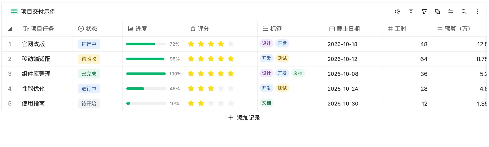
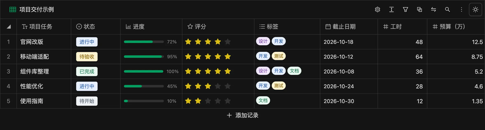
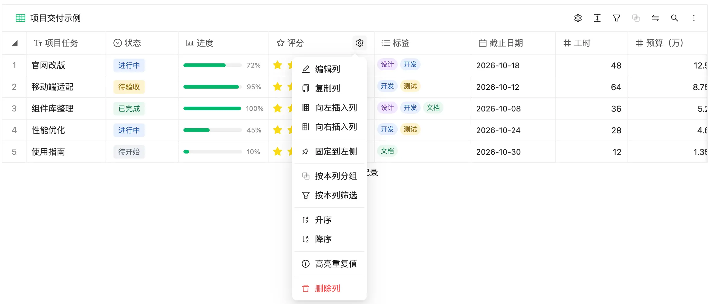
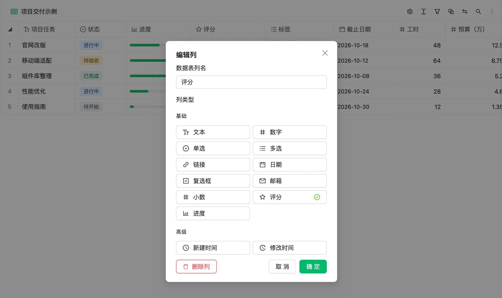

# dim-grid

English | [简体中文](README.md)

An embeddable multidimensional grid for React applications. It supports editing fields and records, filtering and sorting, grouping, search, column statistics, undo and redo, and JSON import and export.

## Preview

The main table view with text, status, progress, rating, tags, and date fields, plus an "Add record" entry at the bottom.




Click a column header to open the column menu for editing, duplicating, inserting, pinning, grouping, filtering, sorting, and highlighting duplicates.



The "Edit column" dialog offers all 13 field types.



## Features

- **13 field types:** text, number, decimal, single select, multiple select, link, date, checkbox, email, rating, progress, created time, and modified time.
- **Column actions:** add, edit, duplicate, and insert columns, pin columns, and group, filter, sort, and highlight duplicates by column.
- **Table views:** filtering, sorting, grouping, search, pinned and hidden columns, adjustable column width and row height, duplicate highlighting, and column statistics.
- **Record actions:** add, edit, duplicate, drag to reorder, undo, and redo.
- **Data persistence:** optional browser local storage and JSON backup import and export.

## Run the demo

Requires Node.js 22.18+ and pnpm.

```sh
pnpm install
pnpm dev
```

Open the local URL shown in your terminal. The demo data in [`src/demoData.ts`](src/demoData.ts) contains all 13 field types and five editable records. The demo has browser storage disabled, so refreshing resets it to the initial demo data. Live demo: <https://fewismuch.github.io/dim-grid/>.

## Use in a React project

The host project must provide React 18 or 19 and React DOM. For now, you can pack this repository into a tarball and install it in the host project:

```sh
pnpm pack
# Run in the host project:
pnpm add /path/to/dim-grid-1.0.0.tgz
```

Import the component and its stylesheet, then provide fields, rows, and a definite height:

```tsx
import { DimGrid } from 'dim-grid'
import 'dim-grid/style.css'

const initialData = {
  fields: [
    { id: 'name', label: 'Name', type: 'text' as const },
    { id: 'done', label: 'Done', type: 'checkbox' as const },
  ],
  rows: [
    { id: 'person-1', name: 'Alice', done: false },
    { id: 'person-2', name: 'Bob', done: true },
  ],
}

export function RecordsPage() {
  return <DimGrid height={600} storageKey="records-page.document" initialData={initialData} />
}
```

`initialData` initializes the grid only on its first mount. Every field and row needs a unique `id`; row values are keyed by field ID. By default, data already saved under `storageKey` takes precedence over `initialData`. Changing the `initialData` prop does not reset the current grid.

Set `enableLocalStorage={false}` to disable browser storage. The grid then starts from `initialData` and does not read or write `localStorage`. Edits last only for the current component instance; JSON import and export remain available. Theme preferences are also not saved by default in this case; set `persistTheme` to save them separately.

### Component props

| Prop | Type | Default | Description |
| --- | --- | --- | --- |
| `initialData` | `{ fields, rows, view? }` | Built-in sample data | Initial grid content; `view` is optional. |
| `locale` | `'zh-CN' \| 'en-US'` | `'zh-CN'` | Language for the grid UI, Ant Design controls, and date editor. |
| `theme` | Ant Design `ThemeConfig` | — | Theme passed to the grid's internal `ConfigProvider`; grid colors also follow Ant Design tokens. |
| `enableLocalStorage` | `boolean` | `true` | Whether to read from and write to browser local storage. |
| `persistTheme` | `boolean` | Same as `enableLocalStorage` | Whether to remember the toolbar's light/dark choice in browser storage. |
| `storageKey` | `string` | `dim-grid.document` | Local storage key; use a different key for each grid on the same origin. |
| `height` | CSS height value | `100%` | Grid height; with `100%`, the parent must have a definite height. |
| `className`, `style` | React container props | — | Attributes for the outer container. |

The grid configures its own Ant Design controls and date editor. The host app does not need to add a `ConfigProvider` or call the global `dayjs.locale()` for this component:

```tsx
<DimGrid
  locale="en-US"
  theme={{ token: { colorPrimary: '#00b96b' } }}
  initialData={initialData}
  height={600}
/>
```

Use the moon/sun button at the right of the toolbar to switch themes. With `persistTheme` enabled, the choice is saved under `${storageKey}.colorMode` and survives a refresh. To start in dark mode, pass `theme={{ algorithm: antdTheme.darkAlgorithm }}` (import `theme as antdTheme` from `antd`).

The `locale` prop translates the grid UI. Field names, options, and row values supplied by the host app remain as provided.

### Field values

Field types are defined in [`src/model/table.ts`](src/model/table.ts). Use numbers for number and decimal fields, booleans for checkboxes, and `Date` objects for dates in memory. Multiple selections and links are stored in memory as JSON array and JSON object strings, respectively. Created and modified times use ISO timestamp strings. See [`src/demoData.ts`](src/demoData.ts) for sample rating and progress values.

The public entry point also exports types such as `TableDocument`, `FieldDef`, and `RowData`, plus `serializeDocument` and `deserializeDocument`. If your data comes from an exported JSON backup, use `deserializeDocument(json)` to convert it to the component's data structure.

## Development and builds

```sh
pnpm check      # Type checking, linting, tests, and builds
pnpm build      # Standalone demo site
pnpm build:lib  # ESM, CommonJS, CSS, and TypeScript declarations
```

Built with Vite, React, Ant Design, and react-datasheet-grid.

## License

[MIT](LICENSE)
